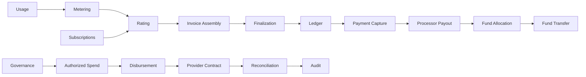

# CoFi

**Community Finance — deterministic financial infrastructure for programmable money flows.**

[](https://github.com/TheHalfMoon/CommunityFinance-CoFi/actions/workflows/cofi-core.yml)
[](https://github.com/TheHalfMoon/CommunityFinance-CoFi/releases/latest)
[](https://www.rust-lang.org/)
[](LICENSE)

CoFi is an open-source Rust workspace for building auditable financial systems where billing, payments, shared funds, governance, settlement, and reconciliation must remain deterministic and explainable.

The project is built around a native double-entry ledger, typed financial identities, checked integer money, exact replay semantics, fail-closed validation, and explicit authorization lineage.

## What CoFi provides

| Area | Capability |
| --- | --- |
| Ledger | Double-entry accounting, account registry, balance validation, idempotent commits |
| Billing | Receivables, revenue recognition, invoice obligations, deterministic finalization |
| Metering & rating | Usage aggregation, pricing, subscription-bound authorization |
| Payments | Capture accounting, processor clearing, payout reconciliation |
| Community finance | Shared funds, allocation, transfer, deterministic revenue distribution |
| Governance | Policy-bound proposals, approvals, quorum, authorized spending |
| Disbursements | Vendor payment lifecycle, provider-neutral contracts, reconciliation |
| Audit | Tamper-evident event chains and deterministic verification |
| Authorization | End-to-end commercial lineage from subscription through fund movement |

## Architecture



The runtime is split into focused Rust crates under `crates/`. Financial effects stay behind explicit accounting boundaries; authorization layers preserve the lineage that permitted each transition.

See [docs/ARCHITECTURE.md](docs/ARCHITECTURE.md) for the component map and invariants.

## Design guarantees

- **Deterministic:** equivalent inputs produce equivalent canonical state.
- **Idempotent:** exact replay has zero duplicate economic effect.
- **Fail-closed:** invalid identity, timing, scope, currency, amount, or lineage is rejected before mutation.
- **Integer money:** economic values use checked integer minor units instead of floating-point arithmetic.
- **Typed boundaries:** financial identities and state transitions are explicit.
- **No unsafe Rust:** the workspace forbids `unsafe`.
- **Reviewable:** release gates bind CI and semantic review evidence to exact commits.

## Quick start

### Requirements

- Rust **1.85+**
- Git

```bash
git clone https://github.com/TheHalfMoon/CommunityFinance-CoFi.git
cd CommunityFinance-CoFi

cargo check --workspace --all-targets --all-features
cargo test --workspace --all-targets --all-features
```

### Release-grade checks

```bash
cargo fmt --all -- --check
cargo clippy --workspace --all-targets --all-features -- -D warnings
cargo test --workspace --all-targets --all-features
cargo +1.85.0 check --workspace --all-targets --all-features
```

## Workspace

| Layer | Primary crates |
| --- | --- |
| Core accounting | `cofi-ledger`, `cofi-billing`, `cofi-payments` |
| Commercial engine | `cofi-metering`, `cofi-rating`, `cofi-invoicing`, `cofi-subscriptions` |
| Authorization | rating, invoice, finalization, payment, payout, allocation, and transfer authorization crates |
| Community finance | `cofi-community` and fund authorization layers |
| Governance & spending | `cofi-governance`, `cofi-spending`, `cofi-disbursements` |
| Operations & trust | `cofi-provider-contract`, `cofi-reconciliation`, `cofi-audit` |

## Documentation

- [Architecture](docs/ARCHITECTURE.md)
- [Security](SECURITY.md)
- [Contributing](CONTRIBUTING.md)
- [Changelog](CHANGELOG.md)
- [Project status](PROJECT_STATUS.md)

## Release

The current stable release is **v1.0.2**. See the [latest release](https://github.com/TheHalfMoon/CommunityFinance-CoFi/releases/latest).

## Security

Do not publish sensitive vulnerability details in a public issue. Follow [SECURITY.md](SECURITY.md).

## Contributing

Contributions are welcome. Start with [CONTRIBUTING.md](CONTRIBUTING.md).

## License

Licensed under the [Apache License 2.0](LICENSE).
