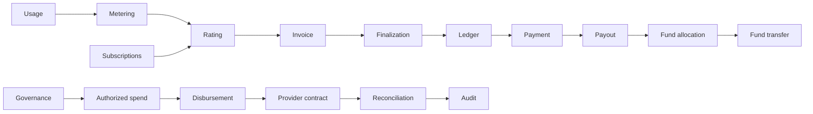

<div align="center">

<picture>
  <source media="(prefers-color-scheme: dark)" srcset="docs/assets/cofi-mark-dark.svg" />
  <source media="(prefers-color-scheme: light)" srcset="docs/assets/cofi-mark-light.svg" />
  
</picture>

# CoFi

**Local-first financial infrastructure for auditable money flows.**

Double-entry accounting · billing · payments · shared funds · governance · reconciliation

[Website](https://thehalfmoon.github.io/CommunityFinance-CoFi/) · [Download](https://github.com/TheHalfMoon/CommunityFinance-CoFi/releases/latest) · [Architecture](docs/ARCHITECTURE.md) · [Security](SECURITY.md)

[](https://github.com/TheHalfMoon/CommunityFinance-CoFi/actions/workflows/cofi-core.yml)
[](https://github.com/TheHalfMoon/CommunityFinance-CoFi/actions/workflows/cofi-desktop.yml)
[](https://github.com/TheHalfMoon/CommunityFinance-CoFi/releases/latest)
[](https://www.rust-lang.org/)
[](LICENSE)

</div>

---

CoFi is an open-source financial platform built around a deterministic Rust core and a local-first desktop application. The accounting model is explicit: money is represented in checked integer minor units, journal entries balance by currency, exact replay is idempotent, and invalid financial state fails before mutation.

The current stable release is **v1.1.1**.

## Desktop

<p align="center">
  
</p>

CoFi Desktop is a Tauri 2 application linked directly to the canonical `cofi-ledger` crate through typed native IPC.

- **Windows x64:** MSI and NSIS installers
- **Runtime:** local-first; no cloud service is required by the desktop shell
- **Release integrity:** SHA-256 checksums are published with every Windows release
- **Download:** [latest GitHub release](https://github.com/TheHalfMoon/CommunityFinance-CoFi/releases/latest)

> Windows packages are currently unsigned. Windows may show a SmartScreen or unknown-publisher warning until code signing is added.

## Financial core

| Area | Responsibility |
| --- | --- |
| Ledger | Double-entry journal, account registry, balance validation, replay protection |
| Billing | Receivables, revenue recognition, invoice obligations |
| Metering & rating | Usage aggregation, pricing, subscription-bound authorization |
| Payments | Capture accounting, processor clearing, payout accounting |
| Community finance | Shared funds, allocation, transfer, revenue distribution |
| Governance | Policies, proposals, approvals, quorum, authorized spending |
| Disbursements | Vendor payment lifecycle and provider-neutral contracts |
| Reconciliation | Canonical/provider state comparison |
| Audit | Tamper-evident event chains |
| Authorization | Financial lineage from commercial intent through fund movement |

## Architecture



The Rust workspace is split into focused crates with accounting and authorization kept as separate boundaries. Sensitive financial inputs are derived from canonical prior state instead of being accepted as caller-selected facts.

See [docs/ARCHITECTURE.md](docs/ARCHITECTURE.md) for the crate map and invariants.

## Guarantees

- **Balanced entries.** Every committed journal entry balances by currency.
- **Integer money.** Economic values use checked integer minor units.
- **Idempotent replay.** Exact replay has zero duplicate economic effect.
- **Fail-closed validation.** Scope, identity, currency, timing, amount, and lineage are validated before mutation.
- **Typed boundaries.** Financial identities and state transitions are explicit.
- **No unsafe Rust.** The workspace forbids `unsafe`.
- **Exact-head review.** Governed changes bind review evidence and CI to the commit being merged.

## Quick start

### Core workspace

Requirements: **Rust 1.85+** and **Git**.

```bash
git clone https://github.com/TheHalfMoon/CommunityFinance-CoFi.git
cd CommunityFinance-CoFi

cargo check --workspace --all-targets --all-features
cargo test --workspace --all-targets --all-features
```

### Desktop development

Requirements: Node.js 24, Rust 1.85+, and the platform prerequisites for Tauri 2.

```bash
cd apps/desktop
npm ci
npm run test:ipc
npm run desktop:dev
```

Build the Windows desktop bundle:

```bash
cd apps/desktop
npm ci
npm run desktop:build
```

## Repository layout

```text
CommunityFinance-CoFi/
├── apps/
│   └── desktop/             Tauri 2 + React desktop application
├── crates/
│   ├── cofi-ledger/         Double-entry accounting core
│   ├── cofi-billing/        Receivable and revenue accounting
│   ├── cofi-payments/       Capture and payout accounting
│   ├── cofi-community/      Shared funds and community finance
│   ├── cofi-governance/     Policy and approval engine
│   ├── cofi-reconciliation/ Provider reconciliation
│   └── ...                  Focused authorization and domain crates
├── docs/
│   └── ARCHITECTURE.md
├── site/                    Public download landing page
└── .github/                 CI, review, release, and identity gates
```

## Release checks

The core workspace is qualified with:

```bash
cargo fmt --all -- --check
cargo clippy --workspace --all-targets --all-features -- -D warnings
cargo test --workspace --all-targets --all-features
cargo +1.85.0 check --workspace --all-targets --all-features
```

Desktop release CI additionally verifies dependency installation and audit, frontend compilation, IPC tests, native Rust qualification, MSI/NSIS generation, and release checksums.

## Documentation

- [Architecture](docs/ARCHITECTURE.md)
- [Desktop](apps/desktop/README.md)
- [Security policy](SECURITY.md)
- [Contributing](CONTRIBUTING.md)
- [Changelog](CHANGELOG.md)
- [Project status](PROJECT_STATUS.md)
- [Support](SUPPORT.md)

## Security

Please do not publish sensitive vulnerability details in a public issue. Follow the private reporting process in [SECURITY.md](SECURITY.md).

## Contributing

Contributions are welcome. Read [CONTRIBUTING.md](CONTRIBUTING.md) before opening a pull request.

## License

CoFi is licensed under the [Apache License 2.0](LICENSE). See [NOTICE](NOTICE) for project copyright information.
