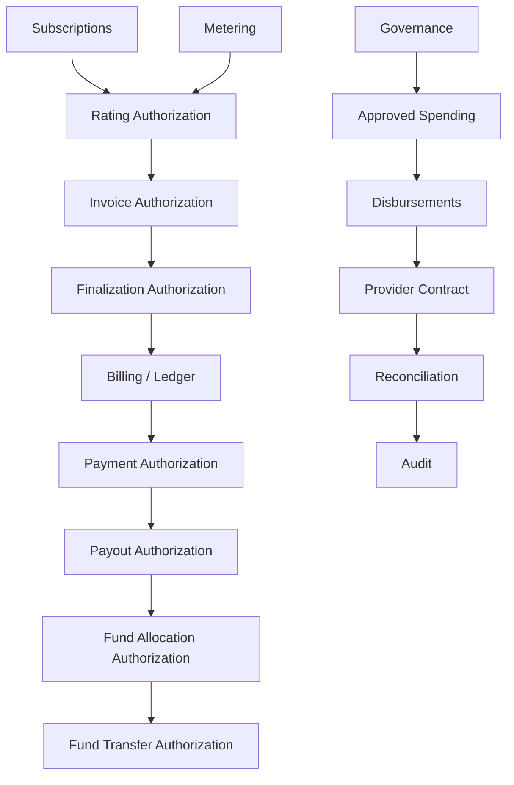

# CoFi Architecture

CoFi is organized as a set of small Rust crates with explicit financial and authorization boundaries.

## Principles

1. **The ledger is authoritative for economic state.**
2. **Every financial mutation is deterministic and idempotent.**
3. **Authorization and accounting are separate concerns.**
4. **Replay must never duplicate economic effect.**
5. **Scope, currency, identity, amount, and time are validated before mutation.**
6. **Money is represented with checked integer minor units.**
7. **Failures do not reserve identities unless canonical state was committed.**

## Financial flow

## Crate map

### Accounting

- `cofi-ledger` — double-entry entries, account registry, balances, replay and business-key protection.
- `cofi-billing` — invoice-side accounting and receivable/revenue recognition.
- `cofi-payments` — capture clearing and processor payout accounting.

### Commercial engine

- `cofi-metering` — deterministic usage events and aggregation.
- `cofi-rating` — integer-based usage pricing.
- `cofi-invoicing` — draft assembly and canonical charge binding.
- `cofi-subscriptions` — time-bound commercial plan assignment.

### Authorization lineage

- `cofi-rating-authorization`
- `cofi-invoice-authorization`
- `cofi-finalization-authorization`
- `cofi-payment-authorization`
- `cofi-payout-authorization`
- `cofi-fund-allocation-authorization`
- `cofi-fund-transfer-authorization`

These crates derive sensitive financial inputs from canonical prior state instead of accepting caller-selected accounting facts.

### Community finance and governance

- `cofi-community` — communities, parties, memberships, shared funds, allocation, transfer, and distribution.
- `cofi-governance` — policy-bound proposals, approvals, roles, and quorum.
- `cofi-spending` — authorization-backed fund spending.
- `cofi-disbursements` — vendor disbursement lifecycle.

### Operations and trust

- `cofi-provider-contract` — provider-neutral request/observation contracts.
- `cofi-reconciliation` — canonical/provider state comparison.
- `cofi-audit` — tamper-evident audit streams.

## Invariants

### Ledger integrity

Every committed journal entry balances by currency. Accounts are validated for scope, currency, and kind before financial mutation.

### Replay

Exact replay is idempotent. Reuse of an identity with different payload or lineage fails closed.

### Authorization

Callers do not get to override financial facts already established by canonical prior state. Authorization layers derive those facts and preserve the lineage used to approve the transition.

### Error handling

Rejected requests do not partially mutate state and do not reserve business identities unless the underlying canonical operation committed them.

## Compatibility

The workspace targets Rust 1.85 or newer and uses Rust edition 2024.
