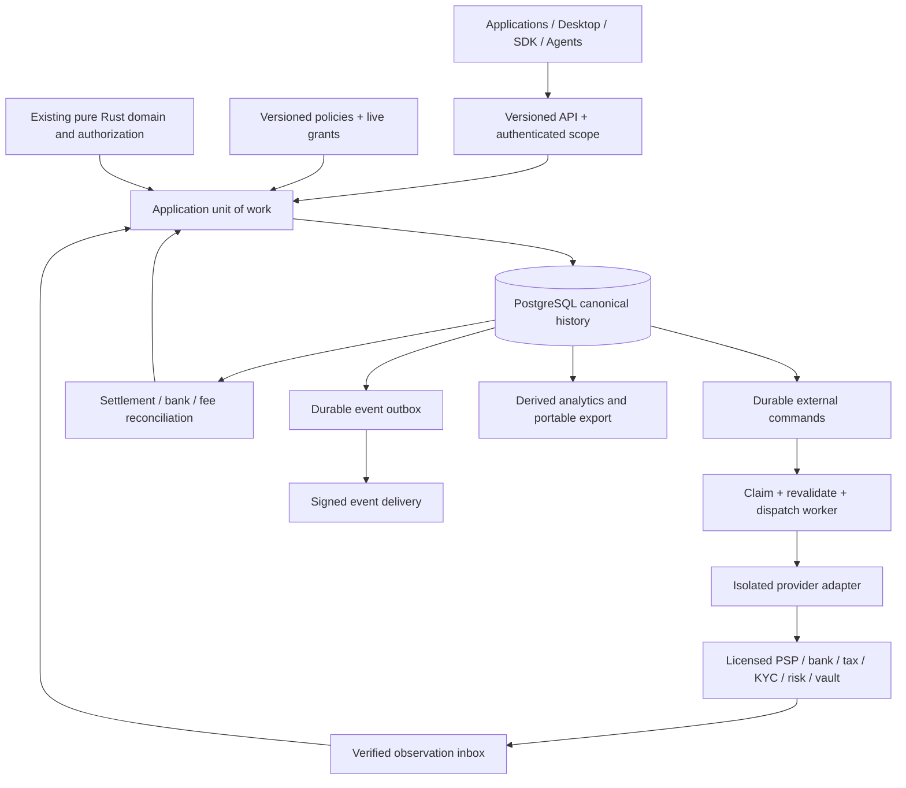

# CoFi architecture 2

Proposal grounded in [live state](../research/LIVE_STATE.md). Preserve the existing 21-crate domain and authorization topology. Do not rename everything `cofi-domain`, replace the ledger or copy another platform's ownership graph.

## One canonical owner

PostgreSQL stores CoFi's accepted commands, economic objects, authorization receipts, append-only journals, observations and audit positions. The pure Rust crates define legality and deterministic accounting. The application service is the only normal writer. A provider supplies execution/settlement evidence; it never writes a CoFi journal or chooses its account mapping. The ledger is authoritative bookkeeping, not an assertion that an unverified provider report is reality. Reconciliation can discover an error and initiate an authorized append-only correction.

| Boundary | Responsibility | Must not do |
| --- | --- | --- |
| Existing domain/authorization crates | Pure validated transitions, rating, accounting and lineage | Network, clocks, random IDs, SQL, credential access |
| Proposed `cofi-storage` | Transaction-scoped repositories, validated codecs, journal/history recovery, migrations | Authorize an economic operation independently of domain/service |
| Proposed `cofi-application` | Authenticated scope, policy, canonical derivation, unit of work and command lifecycle | Trust request-supplied prior financial facts |
| Proposed `cofi-service` | HTTP/OpenAPI, worker, scheduler, administration and local sandbox | Introduce an alternate mutation path in controllers or jobs |
| Provider execution runtime | Credential-limited network effects and evidence envelopes | Canonical money state, unbounded routing authority |
| Desktop/dashboard/SDK/MCP | Submit intents and display canonical results | Write DB, silently approve, infer settlement from UI status |
| Derived analytics/export | Versioned read models with watermarks and metric definitions | Feed stale aggregates into spending authority |

Start one application binary with API and worker process modes, plus PostgreSQL. Outbox, events, recovery, reconciliation and routing are modules until separate dependency/lifecycle needs justify crates. Redis/Kafka/ClickHouse/Kubernetes are not initial correctness dependencies. Isolate connector execution in a process/HTTP boundary when third-party code or card-sensitive handling demands it.

## Minimal identity graph

Organization owns Projects; Project owns sandbox/live Environments. A Principal is human or service/agent, with Membership/Grant attaching scope and authority. LedgerScope represents a bookkeeping boundary within an environment. Party represents a customer, vendor or beneficiary; role relationships do not create a new tenant. Community and Fund use existing organization/community IDs. ConnectedAccount maps a Party to a provider account and regulatory/onboarding status.

Avoid separate Tenant/Merchant/Business/Platform entities with competing ownership. "Merchant" is a provider relationship; "platform" is an organization's activity. Every durable reference uses organization, environment and scope where applicable. Derive these from authenticated context, not an untrusted header. Composite foreign keys and RLS enforce that a valid object ID in one tenant is unusable in another.

Sandbox and live have separate credentials, histories, command queues and event destinations. Explicit environment migration copies configuration only; it never promotes fake money or test authorization to live authority.

## Money plane and control plane

Configuration editors create draft versions. Activation requires sufficient authority, validation and an immutable effective revision. Commands bind policy, pricing, connector capability, route and mapping versions. A future version cannot retroactively alter a historical invoice or accepted command.

Emergency freezes and revocation are live safety overlays: check them atomically immediately before the dispatch claim. Updating a configuration version cannot bypass them. Once an external command is dispatching, revocation is not proof of cancellation; disclose in-flight outcomes and use provider cancel/readback when supported.

## Product components

- **Payments:** intent/attempt/capture/refund/dispute/mandate state independent of postings. Exact ambiguous acceptance is first-class.
- **Billing:** extend current metering/rating/invoicing/subscriptions with immutable pricing, credits and entitlements. One invoice finalization owner.
- **Platform/community finance:** existing funds, approval lineage and distributions; add reservations and provider-bound recipient workflows. Paired cross-scope movement stays balanced within each scope.
- **Agents:** the same deterministic spending authority as humans, with narrower grants. MCP is transport, not a new financial authority.
- **Checkout/links:** common session contract, vault/provider tokenization and provider-required authentication; successful browser redirection never posts money.
- **Routing/recovery:** hard eligibility constraints first; versioned deterministic selection and recorded explanations; no fallback during unknown acceptance.
- **Reconciliation:** compare journal, processor transaction/balance, settlement and bank evidence using explicit identifiers, cutoffs and tolerances. Tolerance classifies a break; it does not mutate money automatically.
- **Analytics:** MRR/ARR, churn, aging, success/decline rates, fee variance, recovery and fund flows have versioned definitions, provenance and freshness. Cash, billed revenue and recognized revenue remain distinct.

## Deployment modes

The pure library remains usable in memory for deterministic testing. `cofi dev` eventually starts an isolated local PostgreSQL, API/worker, dashboard and fake provider. A production flag fails closed without qualified durable storage, migrations and live authority. Local-first means the money plane can operate on user-controlled infrastructure without a hosted dependency; it does not imply uncoordinated offline multi-writer money.

Desktop becomes an operator client of the same local/remote application service. Initially keep its shell and currency IPC intact. Later packaged local PostgreSQL or a qualified embedded backend is a separate operational decision; do not claim the current desktop persists real funds. Do not add a second SQLite money model before proving backend conformance.

Production begins with Docker Compose and documented backup/restore. Kubernetes/Helm, regional failover and managed cloud follow operational evidence. A single region has one authoritative writer topology. Active-active financial writes across independently writable databases are outside initial scope.

## Tradeoffs and interfaces

The first storage implementation uses scope serialization and validated replay to reuse domain semantics. It is deliberately throughput-limited until measured snapshots/deltas are qualified. Do not conceal this with a cache. Database clients/HTTP libraries may use audited unsafe internally; the CoFi domain retains its own unsafe prohibition. MSRV and transitive dependency fit must be decided per implementation grain.

Public API is CoFi-native. A separately named compatibility endpoint may support a documented Stripe subset after semantic fixtures pass. Generated SDKs come from one OpenAPI model; domain serialization uses its own versioned codec. Connector contracts cannot inherit public request objects that admit arbitrary PAN, account mappings or generic provider overrides.

See [durability](DURABLE_LEDGER_PLAN.md), [state model](MONEY_STATE_MODEL.md), [provider contract](CONNECTOR_PLATFORM.md), [security/operations](SECURITY_OPERATIONS.md).
