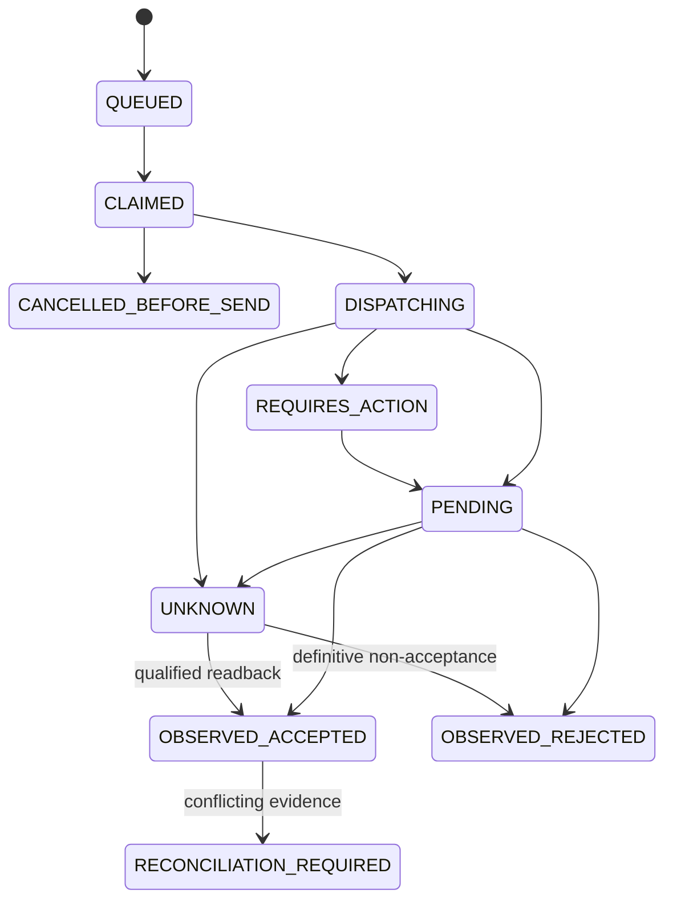

# Money state model

This proposal extends current accounting and authorization primitives. Provider attempts, authorization to spend, card authorizations, economic postings and settlement are different objects. "Payment succeeded" alone is insufficient to determine cash, revenue or payout availability.

## Objects and ownership

| Object | Owner and canonical fields | Economic meaning |
| --- | --- | --- |
| PaymentIntent | CoFi; scope, purpose/obligation, amount/currency, permitted methods, policy and route versions | Desired collection; not money received |
| PaymentAttempt | CoFi; immutable command/provider account/payload/key, dispatch epoch, observations | One qualified external execution attempt |
| PaymentMethodReference | CoFi mapping to provider/vault token, customer, scope, consent/capabilities | Reference, never universal card portability |
| SpendAuthorization | CoFi; exact intent digest, grant/policy, approvers, amount ceiling, beneficiary and expiry | Authority to cause a bounded effect |
| ProviderAuthorization | Observed card/rail authorization, expiry, amount and provider ID | Reservation/approval at provider; not captured or settled cash |
| Capture | CoFi accepted capture identity and matched provider evidence | Accounts for collected obligation into processor clearing |
| Refund | Independent bounded command and provider refund evidence tied to original capture | New economic reversal/return, not deletion of capture |
| Dispute | Provider case, reason, deadline, evidence and liability transitions | Contingent/actual withholding or loss according to accounting policy |
| Mandate | Provider reference plus recorded customer consent, scope, amount/frequency and revocation evidence | Authority for future off-session flow, separate from organizational spending policy |
| Settlement | Matched provider batch, gross/net/fees/FX/returns, cutoff and bank evidence | Clears processor receivable; no invented fee split |
| Payout | CoFi bounded outgoing intent/attempt/settlement | Requested, accepted and paid-out are separate milestones |
| Transfer / Allocation | Existing scoped fund movement, beneficiary claims and linked journal | Internal bookkeeping; not proof of legal external transfer |
| BalanceTransaction | Read projection linking effect and journal to observed fee/settlement | Derived explanation, not an independent posting API |
| ProviderObservation | Immutable verified evidence with raw digest, account, event/readback sequence and adapter revision | Input to domain admission, not direct authority |
| ReconciliationCase | Evidence mismatch and authorized disposition | Explains uncertainty and corrective action |

## Attempt transition table

| From | Trigger and prerequisites | To | Posting / retry rule |
| --- | --- | --- | --- |
| none | Valid intent and exact authorization, budget reserved atomically | QUEUED | No provider success claimed |
| QUEUED | Lease claim; account/capability/route permitted | CLAIMED | No external effect |
| CLAIMED | Live grant/freeze/budget recheck and durable dispatch marker | DISPATCHING | Network send allowed outside transaction |
| CLAIMED | Safe pre-dispatch denial | CANCELLED_BEFORE_SEND | Release reservation, append denial |
| DISPATCHING | Qualified response requires authentication/redirect | REQUIRES_ACTION | Keep attempt bound; user action is not ledger evidence |
| DISPATCHING / REQUIRES_ACTION | Verified provider pending response | PENDING | Schedule readback; no blind retry |
| DISPATCHING / PENDING | Qualified accepted authorization/capture evidence | OBSERVED_ACCEPTED | Apply specific effect once; authorization alone has no capture posting |
| DISPATCHING / PENDING | Definitive non-acceptance, not generic HTTP error | OBSERVED_REJECTED | New attempt possible under fresh bounded checks |
| DISPATCHING | Timeout, lost process, uncertain 5xx or readback contradiction | UNKNOWN | Freeze resend/fallback; keep exposure reserved |
| UNKNOWN | Qualified readback proves accepted/rejected outcome | OBSERVED_ACCEPTED / OBSERVED_REJECTED | Apply unique effect or permit new attempt |
| any observed state | Contradictory terminal evidence/amount/account | RECONCILIATION_REQUIRED | Preserve both observations; no speculative overwriting |

Readback that returns no item is inconclusive unless the provider's qualified lookup contract proves final non-acceptance for that exact command. Network failure before dispatch can be locally rejected only if the persisted state and transport guarantee demonstrate no send. Prefer UNKNOWN over an unverifiable inference.

Intent state is an aggregation of immutable attempts/captures/refunds, not the last webhook received. Track authorized/captured/refunded/disputed amounts independently. A refund does not make a historical capture "never happened". Multiple/partial captures require provider-supported capability, explicit child identities and atomic ceilings. Sum captures <= authorized amount unless an explicitly authorized incremental/overcapture contract exists. Sum refunds <= eligible captured amount minus previous accepted/pending refunds. Dispute overlap must not double-debit a refund; matching settlement evidence and policy decide the adjustment.

## Accounting examples

All amounts are integer minor units. Account mappings come from canonical prior state and a versioned chart policy, not request parameters. These examples are bookkeeping templates to qualify with current domain behavior and accounting review.

| Event | Debit | Credit | Evidence / caution |
| --- | --- | --- | --- |
| Invoice recognized | Accounts receivable 10,000 | Revenue or deferred revenue 10,000 | Contract/fulfilment policy chooses recognition; invoice is not always earned revenue |
| Qualified capture applied | Processor clearing receivable 10,000 | Accounts receivable 10,000 | Canonical capture identity, amount/currency/customer match |
| Settlement with known fee 300 | Bank cash 9,700 and processing expense 300 | Processor clearing 10,000 | Processor balance transaction + settlement; bank arrival separate if still in transit |
| Refund accepted | Refund/contra-revenue or refund payable according to policy | Processor clearing/cash payable | Link original capture, invoice credit note and provider refund; never edit old entries |
| Provider withholds dispute reserve | Reserve/receivable account | Available processor clearing | Reserve is not necessarily a realized loss |
| Dispute lost / won | Loss or release entries under explicit liability policy | Matching reserve/clearing accounts | Fee and principal distinguished; evidence authoritative |
| Community allocation | Source liability/claim account | Fund beneficiary liability/claim account | Allocation changes economic claims, not custody institution |

If fees are not itemized, report net/gross evidence and an unresolved difference. A separately approved suspense adjustment can represent an unexplained settlement delta, but must not invent network/interchange/FX components. Cash receipt does not retroactively erase the earlier ambiguity record.

## Billing state

Draft -> Rated -> AuthorizedForFinalization -> Finalized/Open -> PartiallyPaid/Paid, with independently recorded credit notes/void/write-off and delivery status. Finalization locks historical price snapshot, usage window/watermark, tax evidence and customer/legal entity data. Late usage after cutoff follows a documented correction or next-period policy, never silently rewrites the invoice. Invoice payment status derives from unique applied allocations; a provider retry never creates another invoice.

Subscription schedules use half-open periods, calendar/timezone policy and immutable future-effective amendments. Cancellation, pause, grace, trial, dunning and entitlement changes are distinct transitions. A processor mandate permits a charge but does not choose the price or billing period.

Credits have grant/funding/burn/expiry/adjustment records. Paid prepaid credit is not interchangeable with promotional access units or refundable cash. Activate purchased credits only after qualified payment effect. Entitlements derive from contractual state and credit/budget policy; grant counters used for real-time enforcement are transactionally authoritative, while dashboard usage is a lagging projection.

## Platform and community movement

Within one existing ledger scope, use current balanced transfer semantics. Across organizations, create a linked movement ID with separately authorized balanced entries on each side, explicit transit clearing and observed provider transfer. Do not weaken `CrossScopeEntry` to make marketplace flows convenient. If the receiving side cannot commit, the workflow is pending/reconciling; compensating transitions are new history, not DB rollback of an external success.

Split contracts bind recipients, allocation formula, rounding residue, platform fee and refund/dispute liability before capture. Use integer largest-remainder or declared deterministic rounding with stable tie-breaking. Reserves and negative balances obey provider contracts. A recipient claim is not spendable cash while unsettled or frozen. A legal escrow/custody promise requires an appropriate provider and legal arrangement.

## Temporal and causal rules

Store effective time, observed time and trusted recorded time separately. Sequence establishes canonical admission order; wall clock alone does not. Sandbox clocks are explicit injected inputs and cannot advance live grants. Incoming event ordering is provider-specific; terminal contradictions open cases. Refund/dispute reversals can legitimately follow success, so a blanket "terminal states never change" rule would be wrong.

Accepted intent changes create a new revision and invalidate approvals bound to the previous digest. Authorization withdrawal before the dispatch commit prevents send; withdrawal afterward initiates a cancellation attempt and investigation but cannot promise that payment was stopped. Read-only simulation returns proposed postings, policy reasons and version/freshness; it reserves no budget and grants no authority.

## Required replay invariants

One unique economic effect per scoped provider/effect identity; exact intent retry returns its original result; duplicate observation has zero new economic effect; changed payload/lineage conflicts; all journals balance by currency; counters respect approved bounds; historical policy/price mappings remain reconstructable; corrections append; UNKNOWN cannot cause silent fallback. [Durable plan](DURABLE_LEDGER_PLAN.md) and [connector qualification](CONNECTOR_PLATFORM.md) turn these into tests.
